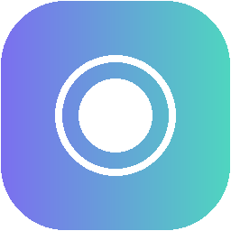

<div align="center">



# NexaMind

### Think smarter. Ask anything. Build anything.

**A full-stack AI assistance platform built with Python, Flask, JavaScript, and modern AI APIs.**

NexaMind is designed to feel like a real AI product — with conversations, persistent history,
streaming responses, Markdown rendering, code highlighting, quick AI tools, authentication,
themes, and provider-independent AI integration.

<br>


</div>

---

## ✨ What is NexaMind?

NexaMind is a full-stack AI assistant web application built from the ground up using
**Python and Flask**.

Instead of being a simple textbox connected to an AI API, NexaMind provides the core
features expected from a modern AI chat product:

- 💬 Multi-turn AI conversations
- ⚡ Real-time streaming responses
- 🧠 Conversation memory and history
- 🔎 Conversation search
- 🛠️ Specialized AI tools
- 📝 Markdown rendering
- 💻 Syntax-highlighted code
- 📋 One-click code copying
- 🔄 Regenerate responses
- 📤 Export conversations
- 🌙 Dark mode
- 👤 Authentication and guest access
- 🛡️ Secure environment-based API configuration
- 🔌 Gemini and OpenRouter provider support
- 🧪 Demo mode when no API key is available

The goal is to demonstrate how an AI-powered product can be designed, implemented,
and deployed as a complete application rather than just an API experiment.

---

# 🚀 Features

## 💬 AI Chat

NexaMind supports natural multi-turn conversations.

### Includes

- Context-aware conversations
- User and AI message separation
- Streaming AI responses
- Typing/thinking states
- Automatic scrolling
- Conversation titles
- Regenerate responses
- Copy responses
- Long-message support
- Empty-message validation

---

## ⚡ Quick AI Tools

NexaMind includes specialized one-click AI workflows.

| Tool | Purpose |
|---|---|
| 🔍 **Explain** | Explain complex topics in simple language |
| 📝 **Summarize** | Convert long content into key points |
| ✍️ **Rewrite** | Improve clarity, grammar, and tone |
| 💡 **Ideas** | Generate creative project and product ideas |
| 💻 **Code** | Generate programming solutions |
| 🐞 **Debug** | Analyze code and identify possible problems |
| 📚 **Study** | Create structured learning explanations |

All tools use the same AI pipeline while changing the system prompt according to
the selected task.

This keeps the backend architecture simple and extensible.

---

# 🧠 AI Architecture

NexaMind separates the application from the AI provider.

```text
                    ┌───────────────────┐
                    │     NexaMind      │
                    │    Web Interface  │
                    └─────────┬─────────┘
                              │
                              ▼
                    ┌───────────────────┐
                    │   Flask Backend   │
                    │    app.py         │
                    └─────────┬─────────┘
                              │
                     AI_PROVIDER
                       /          \
                      /            \
                     ▼              ▼
             ┌──────────────┐  ┌──────────────┐
             │    Gemini    │  │  OpenRouter  │
             │     API      │  │     API      │
             └──────────────┘  └──────────────┘

The provider can be changed through .env without modifying the application code.

Example:

AI_PROVIDER=gemini

or:

AI_PROVIDER=openrouter
⚡ Real-Time Streaming

One of NexaMind's main technical features is real-time AI response streaming.

Instead of waiting for the entire AI response:

User
  │
  ▼
Request
  │
  ▼
AI Provider
  │
  ├── Token 1 ──► Browser
  ├── Token 2 ──► Browser
  ├── Token 3 ──► Browser
  ├── Token 4 ──► Browser
  └── ...

The backend uses Server-Sent Events (SSE) and the browser consumes the stream
using the Fetch API and ReadableStream.

This creates a much more natural AI-chat experience.

Streaming endpoints
POST /api/chat/stream
POST /api/regenerate/stream

The stream can send events such as:

meta
chunk
done
error

The completed response is saved to the database after streaming finishes.

📝 Markdown & Code Rendering

NexaMind supports rich AI responses instead of displaying raw text.

AI responses can contain:

Bold text
Italic text
Headings
Bullet lists
Numbered lists
Blockquotes
Links
Inline code
Fenced code blocks
Syntax highlighting

Example:

def greet(name):
    return f"Hello, {name}!"

print(greet("NexaMind"))

Code blocks include a convenient Copy action so users can copy generated code
without manually selecting it.

🗂️ Conversation Management

Every conversation can be stored and accessed later.

History features
Automatic conversation creation
Automatic conversation titles
Search conversations
Open previous conversations
Delete conversations
Per-user conversation isolation
Persistent message storage

Example:

User
 │
 ├── Conversation 1
 │     ├── Message
 │     ├── AI response
 │     └── Message
 │
 ├── Conversation 2
 │     ├── Message
 │     └── AI response
 │
 └── Conversation 3
       └── ...
👤 Authentication

NexaMind includes a lightweight authentication system.

Users can:

Register
Log in
Continue as a guest
Log out

Passwords are hashed before being stored.

The application also keeps conversations isolated between users.

🎨 User Interface

NexaMind was designed as a complete AI product rather than a basic Flask demo.

UI features
Responsive layout
Sidebar navigation
Conversation search
Quick tool buttons
Welcome screen
Suggestion cards
Message bubbles
AI thinking/streaming state
Copy controls
Regenerate controls
Dark mode
Mobile-friendly sidebar
Gradient brand identity
Empty-state experience

The visual identity uses a violet → teal signal gradient to represent the flow
of information between the user, NexaMind, and the AI model.

🧪 Demo Mode

NexaMind can run even when no AI API key is configured.

Instead of crashing, the application switches to a clearly labeled:

NexaMind Demo Mode

This makes the project easier to demonstrate during:

College presentations
Hackathons
Portfolio reviews
Local development
UI demonstrations

Demo mode also simulates streaming so the frontend can still demonstrate the
AI-chat experience.

🛠️ Technology Stack
Layer	Technology
Programming Language	Python
Backend	Flask
Database	SQLite
Frontend	HTML5, CSS3, Vanilla JavaScript
AI Provider	Google Gemini / OpenRouter
Markdown	marked.js
Code Highlighting	highlight.js
Authentication	Flask sessions + Werkzeug
HTTP Client	Requests
Environment Configuration	python-dotenv
Production Server	Gunicorn
Streaming	Server-Sent Events + Fetch ReadableStream
📁 Project Structure
NexaMind/
│
├── app.py
│   └── Flask application, routes, database,
│       authentication, AI integration and streaming
│
├── database/
│   └── database.db
│       └── SQLite database
│
├── templates/
│   ├── index.html
│   └── login.html
│
├── static/
│   ├── css/
│   │   └── style.css
│   │
│   ├── js/
│   │   └── app.js
│   │
│   └── images/
│       ├── logo.svg
│       ├── logo-*.png
│       └── favicon.ico
│
├── .env
├── .env.example
├── .gitignore
├── requirements.txt
├── Procfile
├── runtime.txt
└── README.md
💻 Getting Started
1. Clone the repository
git clone <your-repository-url>
cd NexaMind
2. Create a virtual environment
Windows PowerShell
python -m venv .venv

Activate it:

.venv\Scripts\Activate.ps1

If PowerShell blocks activation:

Set-ExecutionPolicy -Scope Process -ExecutionPolicy RemoteSigned

Then:

.venv\Scripts\Activate.ps1
3. Install dependencies
pip install -r requirements.txt
4. Configure environment variables

Copy:

.env.example

to:

.env

Then configure your AI provider.

Google Gemini
AI_PROVIDER=gemini

GEMINI_API_KEY=your_gemini_api_key
GEMINI_MODEL=your_gemini_model
OpenRouter
AI_PROVIDER=openrouter

OPENROUTER_API_KEY=your_openrouter_api_key
OPENROUTER_MODEL=your_openrouter_model

You only need to configure the provider you want to use.

🔐 Environment Variables
Variable	Required	Description
SECRET_KEY	Recommended	Flask session security key
AI_PROVIDER	No	gemini or openrouter
GEMINI_API_KEY	Gemini only	Google Gemini API key
GEMINI_MODEL	No	Gemini model to use
OPENROUTER_API_KEY	OpenRouter only	OpenRouter API key
OPENROUTER_MODEL	No	OpenRouter model
PORT	No	Server port
FLASK_DEBUG	No	Flask development mode
Example .env
SECRET_KEY=replace-with-a-long-random-secret

AI_PROVIDER=gemini

GEMINI_API_KEY=your-api-key
GEMINI_MODEL=your-model

OPENROUTER_API_KEY=
OPENROUTER_MODEL=your-model

PORT=5000
FLASK_DEBUG=true

Never commit .env to GitHub.

API keys and secret keys must remain private.

▶️ Running NexaMind

Start the Flask application:

python app.py

You should see:

* Running on http://127.0.0.1:5000

Open:

http://127.0.0.1:5000
🔍 Verify AI Configuration

You can verify whether your environment variables are being loaded:

python -c "from dotenv import load_dotenv; import os; load_dotenv(); print('Provider:', os.getenv('AI_PROVIDER')); print('Key found:', bool(os.getenv('GEMINI_API_KEY')))"

Expected output:

Provider: gemini
Key found: True

You can also check the model loaded by the application:

python -c "import app; print('Model:', app.GEMINI_MODEL)"
🔌 API Reference
Authentication
Method	Endpoint	Description
GET/POST	/login	Login, registration and guest access
GET	/logout	Log out
Conversations
Method	Endpoint	Description
GET	/api/conversations	List conversations
GET	/api/conversations/<id>/messages	Get messages
DELETE	/api/conversations/<id>	Delete conversation

Conversation search can be performed through:

/api/conversations?q=search-term
AI Chat
Standard response
POST /api/chat

Example request:

{
  "message": "Explain Python lists",
  "conversation_id": "optional-id",
  "tool": "explain"
}
Streaming response
POST /api/chat/stream

This endpoint returns an SSE stream containing incremental AI response chunks.

Regeneration
POST /api/regenerate

and:

POST /api/regenerate/stream

These endpoints regenerate the most recent AI response.

Health Check
GET /api/health

Useful for checking:

Server status
Selected AI provider
AI configuration status
🗄️ Database

NexaMind uses SQLite for local persistence.

The database is created automatically inside:

database/database.db

Main entities include:

users
conversations
messages

Relationship:

User
 │
 └── Conversations
       │
       └── Messages
             ├── User message
             └── AI response

SQLite keeps the project lightweight and easy to run locally.

For a larger production application, SQLite can be replaced with PostgreSQL or
another managed database.

🛡️ Security

NexaMind follows several basic security practices:

API keys are loaded from environment variables.
API keys are not hard-coded into the source code.
.env is excluded from Git.
Passwords are hashed using Werkzeug.
Flask sessions use a configurable secret key.
User conversations are isolated.
Input validation is performed on API requests.
AI API failures are handled gracefully.
The application warns when a placeholder secret key is being used.
Before deployment

Replace:

SECRET_KEY=change-this-to-a-long-random-string

with a strong random value.

⚠️ Error Handling

NexaMind is designed to avoid exposing raw backend errors to users.

It handles situations such as:

Missing API key
Invalid API key
AI provider errors
Network failures
Request timeouts
Invalid conversations
Database errors
Empty messages
Messages exceeding the allowed length

The frontend displays a user-friendly message instead of exposing a Python traceback.

🚀 Deployment

NexaMind includes deployment configuration for Python hosting platforms.

The project contains:

Procfile
runtime.txt
requirements.txt

A production server can use Gunicorn.

Example:

gunicorn app:app

For platforms that provide a $PORT environment variable:

gunicorn app:app --bind 0.0.0.0:$PORT --worker-class gthread --workers 2 --threads 4 --timeout 120
Important

Set production environment variables through the hosting provider's environment
configuration.

Do not upload .env to your repository.

💡 Design Philosophy

NexaMind follows three main principles.

1. Simple architecture

The application intentionally uses:

Flask + SQLite + Vanilla JavaScript

instead of introducing unnecessary frameworks and build systems.

2. Real product experience

The goal is not just:

Input → API → Output

Instead:

User
 ↓
Conversation
 ↓
Flask Backend
 ↓
AI Provider
 ↓
Streaming Response
 ↓
Markdown Renderer
 ↓
Persistent History
3. Provider flexibility

The AI layer is separated from the rest of the application.

This allows NexaMind to work with different AI providers without redesigning
the frontend or conversation system.

🧩 Extending NexaMind

The architecture makes it straightforward to add new capabilities.

Possible future features:

📎 File uploads
🖼️ AI image generation
🎤 Voice input
🔊 Text-to-speech
🔍 Web search
📚 Document-based chat
🧠 Retrieval-Augmented Generation (RAG)
📊 AI data analysis
👥 Shared conversations
⭐ Favorite conversations
📌 Message bookmarking
🗃️ PostgreSQL support
📱 Progressive Web App support
🧪 Example Prompts

Try NexaMind with prompts such as:

Give me a creative idea for an AI project.
Explain Python lists with bold text, bullets, and a code example.
Debug this Python code and explain what is wrong.
Create a study plan for learning data structures.
Rewrite this paragraph in a professional tone.
Generate a Flask API for a student management system.
📸 Product Highlights

NexaMind demonstrates:

Modern UI
    +
AI Integration
    +
Streaming
    +
Authentication
    +
Database Persistence
    +
Markdown Rendering
    +
Developer Tools
    +
Responsive UX

This makes it suitable as:

🎓 College project
💼 Portfolio project
🏆 Hackathon project
🧑‍💻 Full-stack development showcase
🤖 AI application demonstration
📊 Project Architecture
                    ┌─────────────────────┐
                    │       Browser       │
                    │ HTML/CSS/JavaScript │
                    └──────────┬──────────┘
                               │
                               │ HTTP / SSE
                               ▼
                    ┌─────────────────────┐
                    │     Flask App       │
                    │       app.py        │
                    └──────┬───────┬──────┘
                           │       │
              ┌────────────┘       └─────────────┐
              ▼                                  ▼
      ┌────────────────┐                 ┌────────────────┐
      │    SQLite      │                 │   AI Service   │
      │    Database    │                 │                │
      └────────────────┘                 └───────┬────────┘
                                                 │
                                      ┌──────────┴──────────┐
                                      ▼                     ▼
                                  Gemini               OpenRouter
🏁 Project Status
Current
✅ AI chat
✅ Gemini integration
✅ OpenRouter integration
✅ Streaming responses
✅ Conversation history
✅ SQLite persistence
✅ Authentication
✅ Guest mode
✅ Quick AI tools
✅ Markdown rendering
✅ Code highlighting
✅ Code copy
✅ Regeneration
✅ Conversation search
✅ Dark mode
✅ Responsive UI
✅ Demo mode
✅ Error handling
Future
⏳ File and document uploads
⏳ Web search
⏳ Voice interaction
⏳ Image generation
⏳ RAG/document chat
⏳ PostgreSQL production database
👨‍💻 Author
<div align="center">
Srikar Pandiri

Computer Science Engineering Student | AI & Full-Stack Developer

NexaMind was built as an original AI assistance project with the goal of combining
AI integration, backend engineering, database design, real-time streaming, and
modern user experience into one complete product.

</div>
📄 License

This project is intended for educational, portfolio, and demonstration purposes.

If you reuse or modify the project, please provide appropriate attribution.

<div align="center">
NexaMind

Think smarter. Ask anything. Get more done.

Built with Python + Flask + AI

</div> ```
